# C_11feb
# Write a C++ program to implement a singly linked list using struct for the node and dynamic memory allocation with new and delete. Implement the following operations: Insertion of a node at the beginning Insertion of a node at the end Deletion of a node Display the entire list Use new to allocate memory for each node, and delete to free memory when deleting nodes.

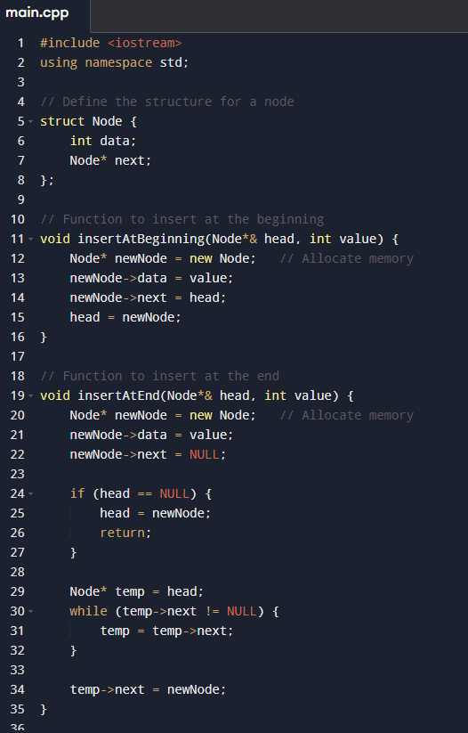
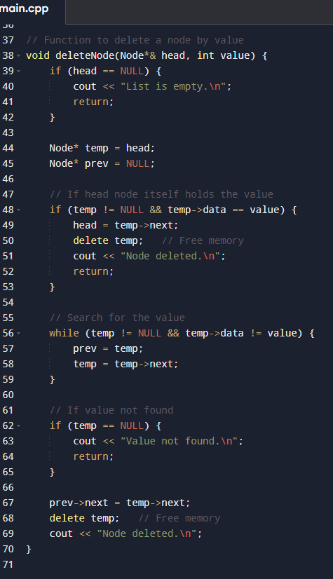
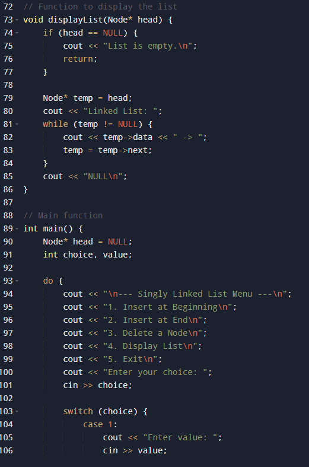
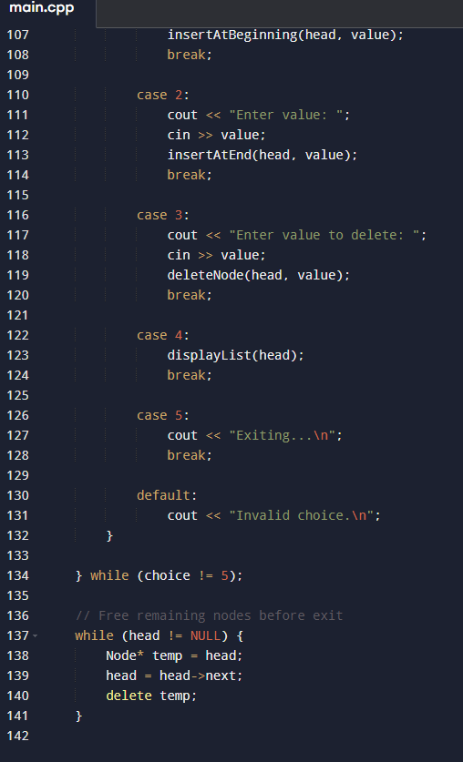
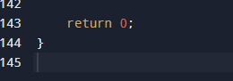

# Output

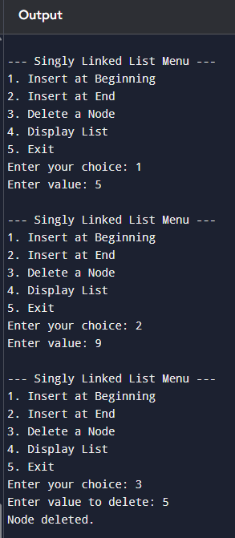
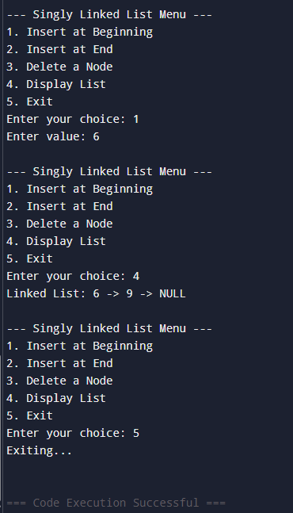

# Write a C++ program that dynamically allocates memory for an array of integers using new based on the size input by the user. The program should: Allow the user to enter the size of the array. Allow the user to enter the values for the array. Print the array. Free the dynamically allocated memory using delete[].

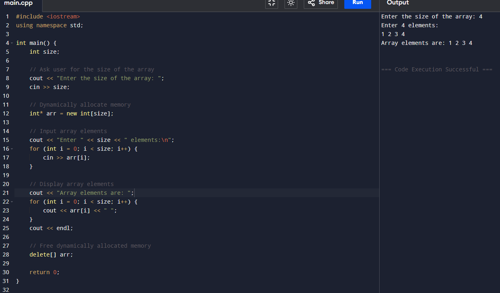

# Swap Two Numbers Using Pointers Write a C++ program that swaps two numbers using pointers. The program should: Declare two integer variables. Use a pointer to swap their values. Print the swapped values.

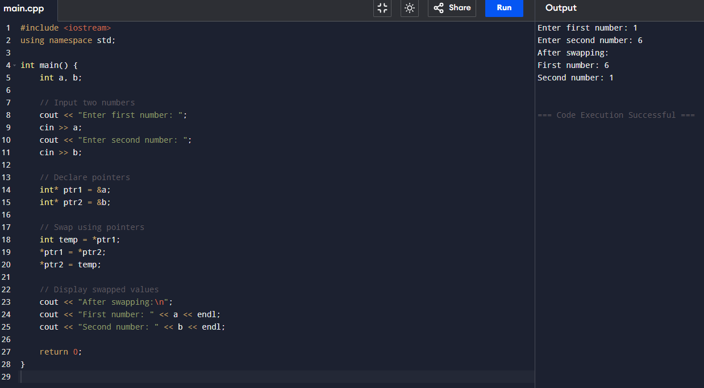

# Write a C++ program that dynamically allocates memory for an array of strings (an array of pointers). The program should: Allow the user to input multiple strings. Print all the strings using the array of pointers. Free the allocated memory for each string and the array of pointers using delete[].

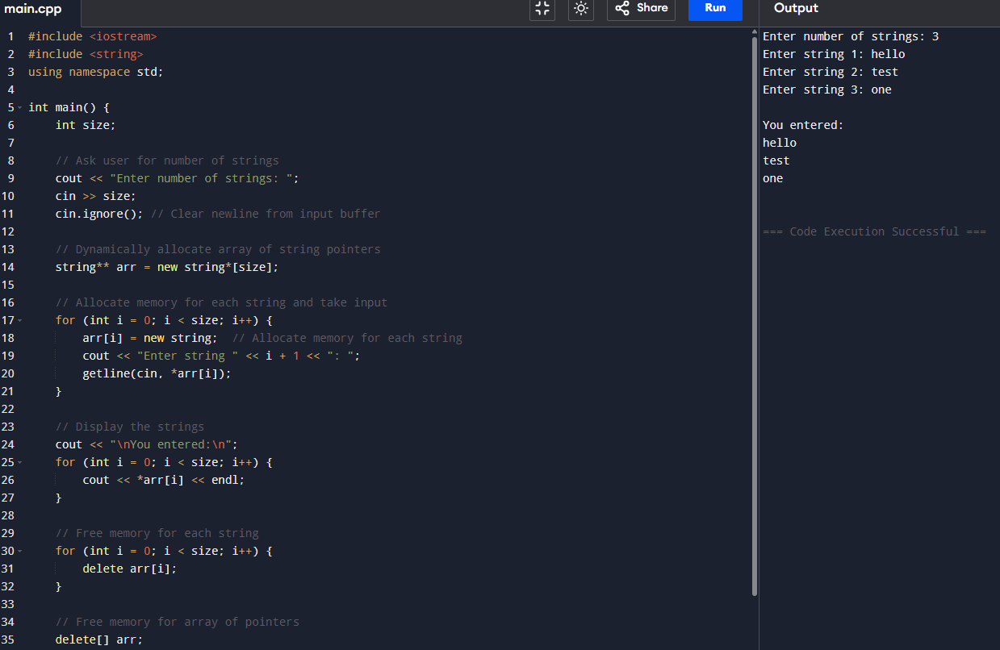
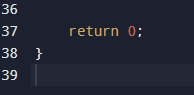

# Write a C++ program that implements a circular buffer using a dynamically allocated array. The program should: Dynamically allocate memory for the buffer. Allow the user to add and remove elements. Handle overflow and underflow conditions. Properly deallocate the memory used by the buffer.

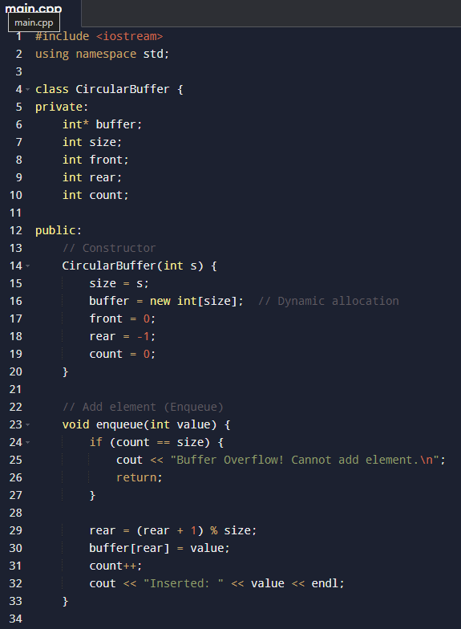
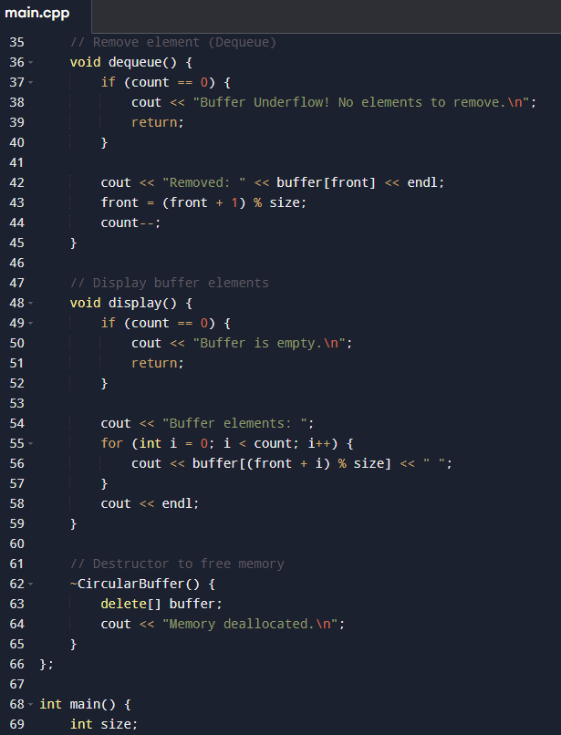
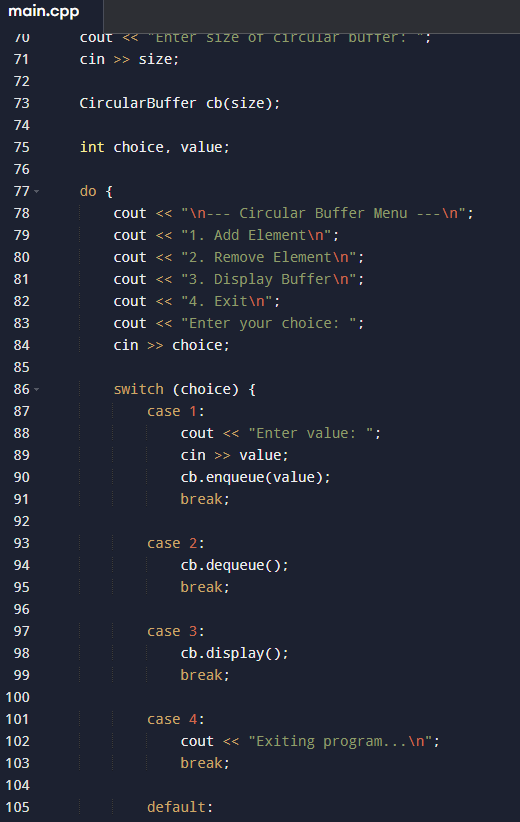
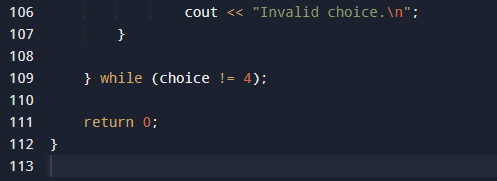

# Output 

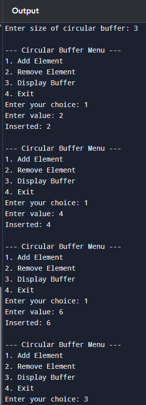
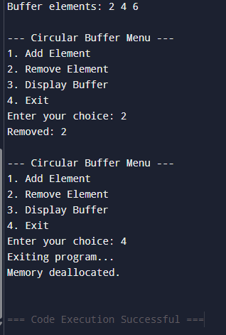

# Write a C++ program that demonstrates the use of a pointer to a constant variable. The program should: Declare a constant variable and a pointer to it. Show how you can read the value pointed to by the pointer, but not modify it.

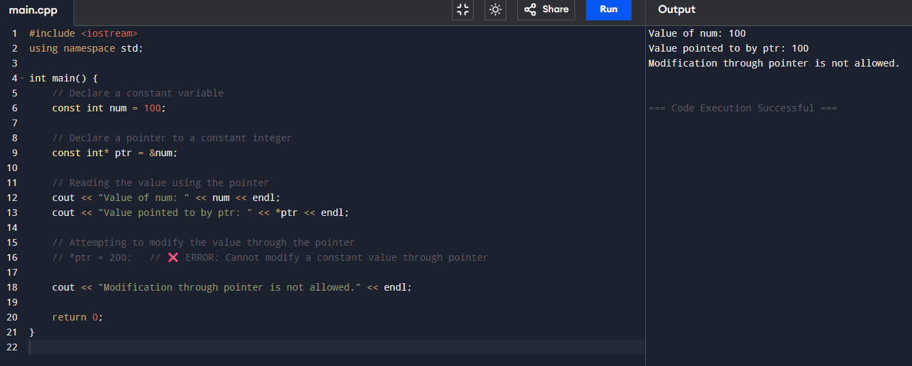

# Write a C++ program where a function returns a reference to a local variable. What are  potential problems and how to avoid them. Implement a version where the function returns a reference to a static or globally declared variable.

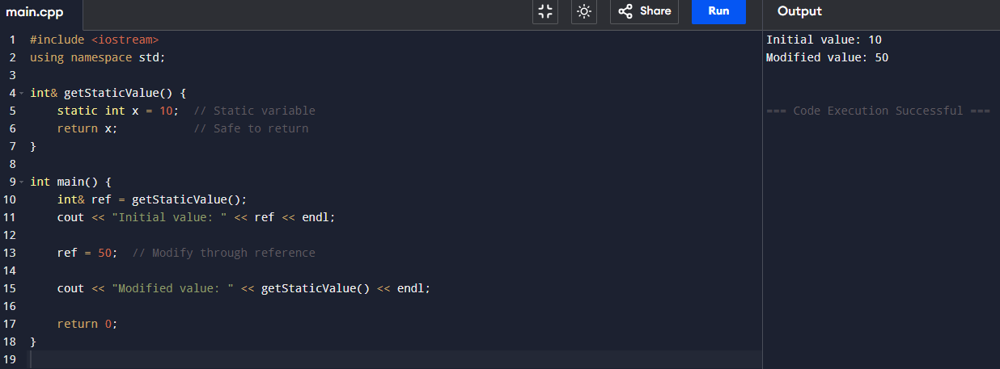